# R-project on Data Visualization.
<h1>ENERGY CONSUMPTION IN NETHERLAND:</h1> 
Enexis, Liander, and Stedin are the three major network administrators of the Netherlands and, together, they provide energy to nearly the entire country. Every year, they release on their websites a table with the energy consumption of the areas under their administration.
The data are anonymized by aggregating the Zipcodes so that every entry describes at least 10 connections.
This market is not competitive, meaning that the zones are assigned. This means that every year they roughly provide energy to the same zipcodes. Small changes can happen from year to year either for a change of management or for a different aggregation of zipcodes.
The structure of dataset is following
Every file is from a network administrator from a specific year. 
The columns in each file are:
<ul>
<li> net_manager: code of the regional network manager </li>
<li> purchase_area: code of the area where the energy is purchased </li>
<li> street: Name of the street </li>
<li> zipcode_from and zipcode_to: 2 columns for the range of zipcodes covered. 
 4 numbers and 2 letters </li>
<li> city: Name of the city</li>
<li> num_connections: Number of connections in the range of zipcodes</li>
<li> delivery_perc: percentage of the net consumption of electricity or gas. The lower </li>
<li> the more energy was given back to the grid (for example if you have solar panels) </li>
<li> perc_of_active_connections: Percentage of active connections in the zipcode range</li>
<li> type_of_connection: principal type of connection in the zipcode range.</li>
<li> For electricity is # fuses X # ampère. For gas is G4, G6, G10, G16, G25 </li>
<li> type_conn_perc: percentage of presence of the principal type of connection in the zipcode range</li>
<li> annual_consume: Annual consume. Kwh for electricity, m3 for gas</li>
<li> annual_consume_lowtarif_perc: Percentage of consume during the low tarif hours. </li>
<li> From 10 p.m. to 7 a.m. and during weekends. </li>
<li> smartmeter_perc: percentage of smartmeters in the zipcode ranges.</li>
</ul>
BACKGROUND OF THE DATASETS: 
Luca Basanisi (Data Scientist in pointlogic Rotterdam, Netherland) uploaded the dataset in Kaggle. 
All the data are taken from the following websites:
<ul>
<li> https://www.enexis.nl/over-ons/wat-bieden-we/andere-diensten/open-data
<li>https://www.liander.nl/partners/datadiensten/open-data/data
<li>https://www.stedin.net/zakelijk/open-data/verbruiksgegevens
</ul>
Some processing was made with the code available at: 
https://github.com/lucabasa/kaggle_dutch_energy/blob/master/raw_data_cleaning.ipynb 
The translation of the column names and descriptions was made by a non-native speaker.

OBJECTIVE AND SCOPE OF THE REPORT,TERGETED AUDIENCE: 
The energy distribution market is not competitive, meaning that the zones are assigned. This means that every year the network administrators roughly provide energy to the same zipcodes. Small changes can happen from year to year either for a change of management or for a different aggregation of zipcodes.

RESULTING/USER AUDIENCES: 
The application is useful for the different energy distributors to enhancing their business by focusing more on the cities that consumed more electricity and gas over the year.

READING AND CLEANING THE DATASET: 
Initially we read three .csv files of the year 2010 from electricity file. Then we combined the files together.
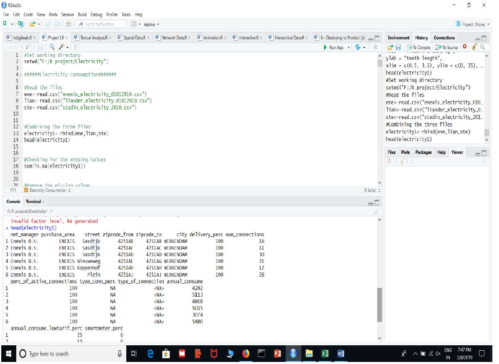
Next cleaning of data by removing NA.
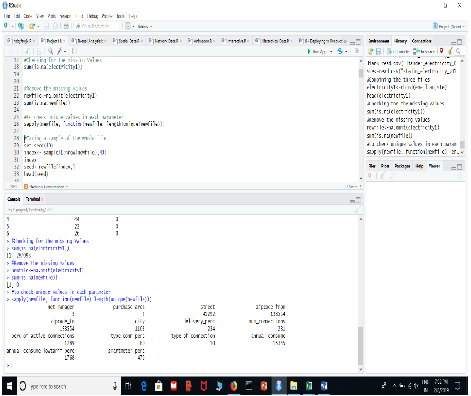
VISUALIZE THE DATASET: 
Now visualizing the data set using different parameters: 
1.Univariate quantitative visualization using parameter annual_consume.
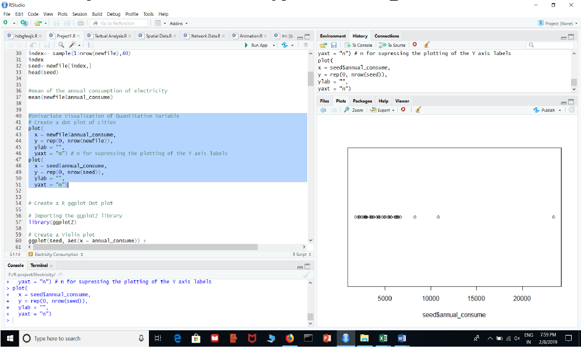
2.visualization using ggplot.
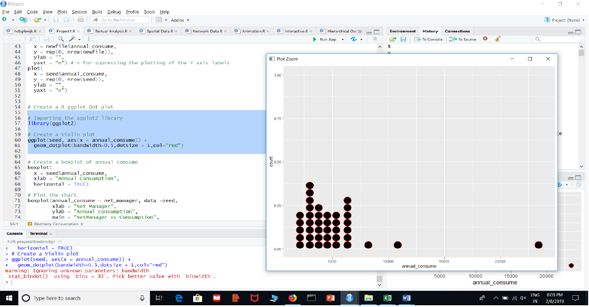
3.Visualization using Boxplot(Bivariate visualization using net_Manager and annual_consume):
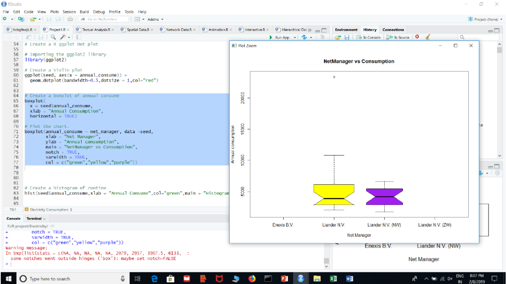
4.Univariate Visualization using annual_consume.
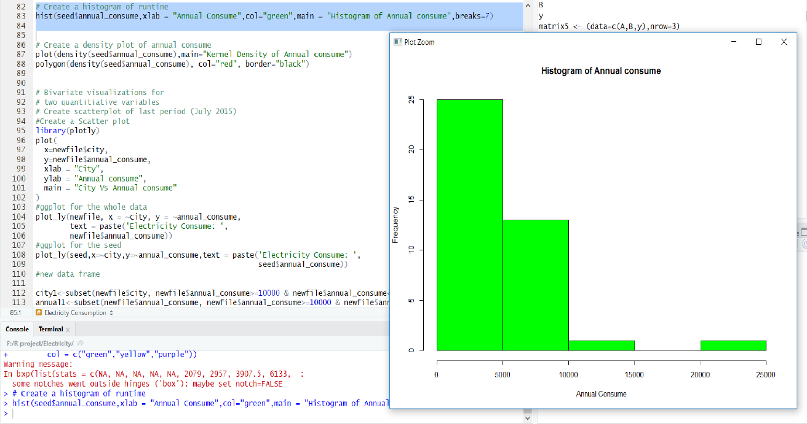
5.Creating density plot.
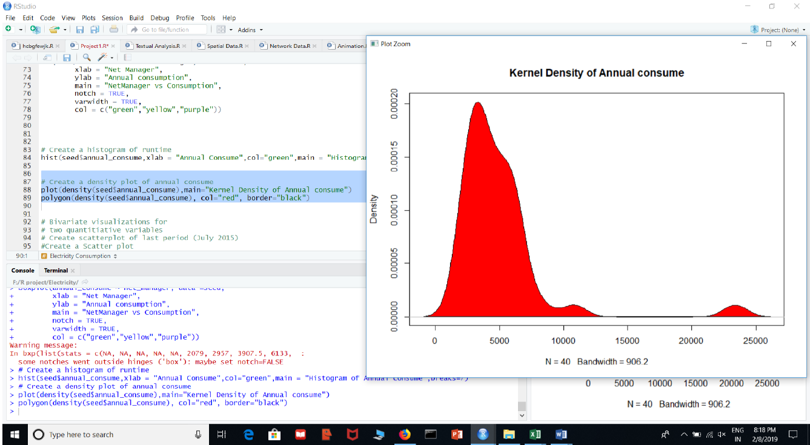
6.Ploting using plotly(city Vs annual_consume)
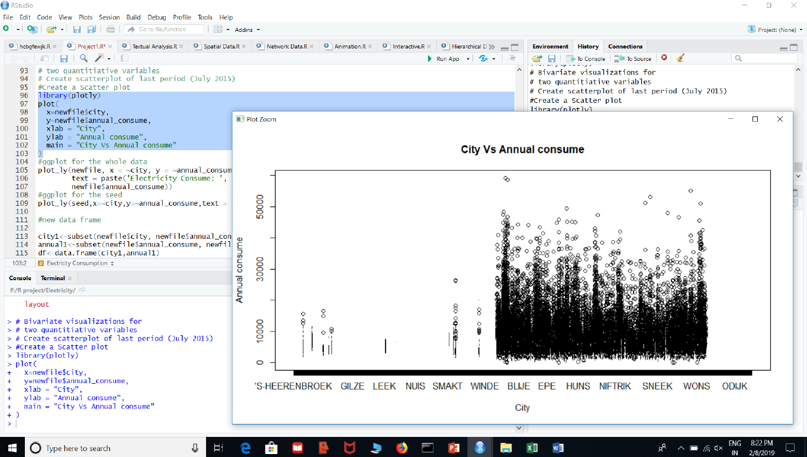
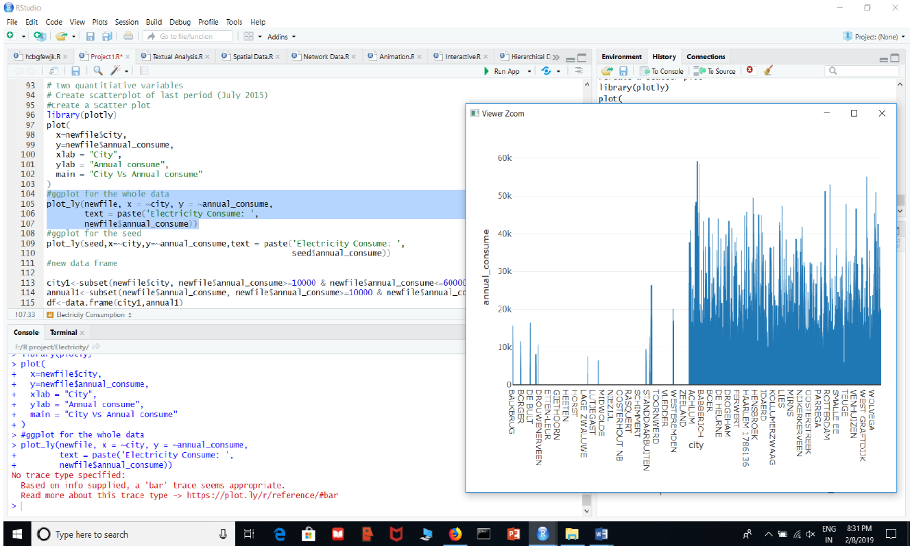
7.Pairs Scatter plot using parameters- city, net_manager, annual_ consume, num_connection.
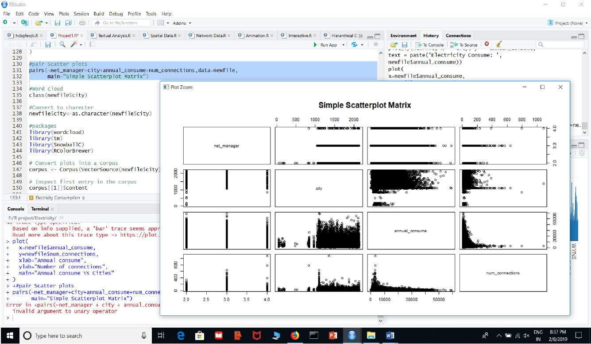
8.Creating Word Cloud using parameter- city.
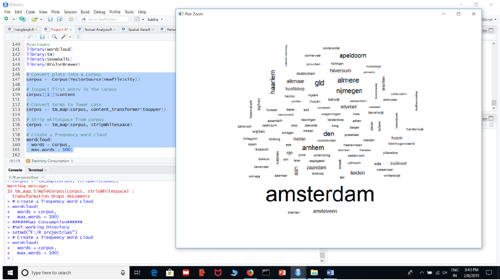
PREPARE THE SHINNY WEB APPLICATION: 
View of the Shinny Application.
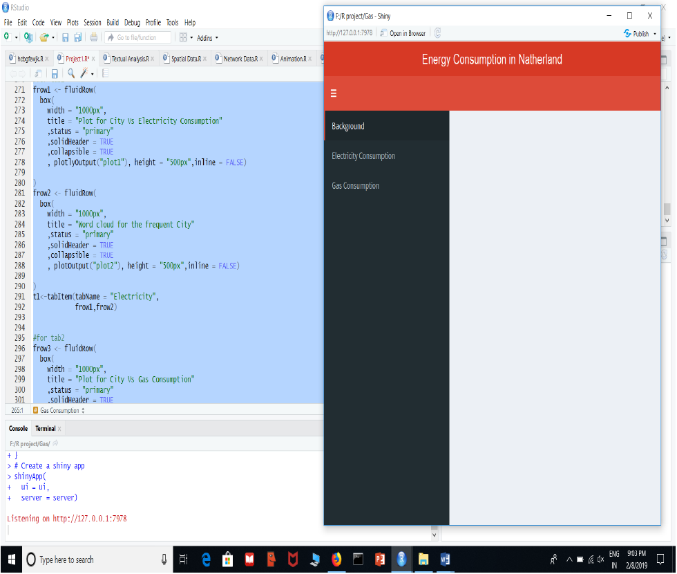
Full view of the Shinny Application.
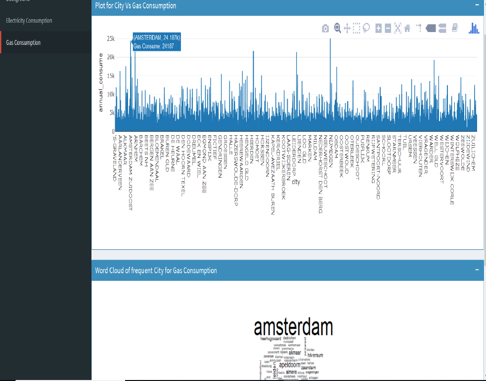

DETERMINE THE RESULTS: 
Aftrer different Quantiative and Qualitative visualization using different parameters on the dataset, finally I can conclude that- 
Top five cities of Netherland that consume maximum amount of Gas over the year 2010 are- 
<ol>
  <li>AMSTERDAM (24187 UNITS).</li>
  <li>HILVERSUM (21749 UNITS).</li>
  <li>LELYSTAD (21437 UNITS).</li>
  <li>NIJKERK ( 25076 UNITS).</li>
<li>WASSENAAR ( 19340 UNITS).</Li>
<ol>
Top five cities of Netherland that consume maximum amount of Electricity over the
year 2010 are-
<ol>
<li>AMSTERDAM (59207 UNITS)</li>
<li> ARINHEM (58553 UNITS).</li>
<li>WIERINGERWERF (55085 UNITS).</li>
<li>RIJNSBURG (51258 UNITS).</li>
<li>ZEEWOLDE (51032 UNITS).</li>
 </ol>
Therefore, the energy administrators must be cautious about the above cities and should provide their best services to the cities for their profit.

